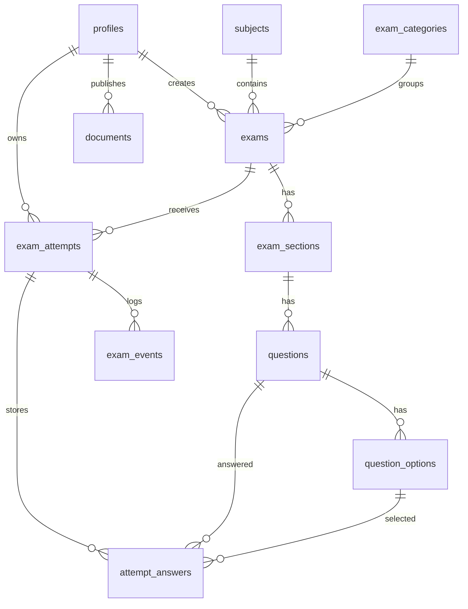

# Database Schema

- Ngay cap nhat: 2026-08-01
- Phien ban: 0.1
- Trang thai: Draft

## Muc Luc

1. Tong quan
2. Mermaid ER diagram
3. Enum va trang thai
4. Chi tiet bang
5. Quan he va rang buoc quan trong
6. Xoa du lieu, audit, timestamp
7. Migration va seed data
8. RLS tuong ung
9. Index cho 100 nguoi dong thoi

## 1. Tong Quan

Schema dung Supabase PostgreSQL. `auth.users` la nguon danh tinh; `profiles` luu role/status. De thi duoc chia theo `subjects`, `exam_categories`, `exams`, `exam_sections`, `questions`, `question_options`. Lam bai duoc luu trong `exam_attempts`, `attempt_answers`, `exam_events`.

## 2. Mermaid ER Diagram

## 3. Enum Va Trang Thai

| Enum | Gia tri |
| --- | --- |
| `profile_role` | `student`, `admin` |
| `profile_status` | `active`, `locked` |
| `exam_status` | `draft`, `published`, `closed`, `archived` |
| `exam_access_type` | `public`, `students_only`, `private` |
| `attempt_status` | `in_progress`, `submitted`, `auto_submitted`, `expired` |
| `submit_reason` | `student_submit`, `time_expired`, `fullscreen_violation`, `account_locked`, `system_recovery` |
| `exam_event_type` | `attempt_started`, `answer_saved`, `fullscreen_exit`, `visibility_hidden`, `fullscreen_return`, `visibility_visible`, `fullscreen_unsupported`, `violation_resolved`, `account_locked`, `auto_submit_requested`, `submit_requested`, `submit_completed`, `network_recovered` |
| `document_status` | `draft`, `published`, `archived` |

## 4. Chi Tiet Bang

### `profiles`

| Field | Type | Null | Ghi chu |
| --- | --- | --- | --- |
| `id` | uuid | No | PK, FK `auth.users.id` |
| `role` | profile_role | No | Default `student` |
| `status` | profile_status | No | Default `active` |
| `display_name` | text | Yes | Ten hien thi |
| `created_at`, `updated_at` | timestamptz | No | Server timestamp |

Constraints: PK `id`; check role/status qua enum. Index: `(role)`, `(status)`.

### `subjects`

Fields: `id uuid PK`, `name text not null`, `slug text not null unique`, `description text null`, `is_active boolean default true`, `created_by uuid FK profiles`, `created_at`, `updated_at`, `deleted_at null`.

Index: `(is_active)`, unique lower slug. Xoa mem khi da co exam.

### `exam_categories`

Fields: `id uuid PK`, `name`, `slug unique`, `description null`, `is_active`, `created_by`, timestamps, `deleted_at`.

Index: `(is_active)`, `(slug)`.

### `exams`

| Field | Type | Null | Ghi chu |
| --- | --- | --- | --- |
| `id` | uuid | No | PK |
| `subject_id` | uuid | No | FK `subjects.id` |
| `category_id` | uuid | Yes | FK `exam_categories.id` |
| `title` | text | No |  |
| `slug` | text | No | Unique |
| `description` | text | Yes |  |
| `status` | exam_status | No | Default `draft` |
| `access_type` | exam_access_type | No | Default `public` |
| `allow_guest_attempt` | boolean | No | Default false |
| `duration_minutes` | integer | No | Check `between 1 and 300` |
| `total_score` | numeric(8,2) | No | Default 0 |
| `randomize_questions` | boolean | No | Default false |
| `randomize_options` | boolean | No | Default false |
| `fullscreen_required` | boolean | No | Default true |
| `show_score_after_submit` | boolean | No | Default true |
| `show_answers_after_submit` | boolean | No | Default false |
| `show_solutions_after_submit` | boolean | No | Default false |
| `published_at`, `closed_at` | timestamptz | Yes | Server-set |
| `created_by`, `updated_by` | uuid | No/Yes | FK profiles |
| `created_at`, `updated_at`, `deleted_at` | timestamptz | No/No/Yes |  |

Index: `(status, access_type)`, `(subject_id, status)`, `(category_id, status)`, full-text/search index cho `title`.

Sau khi exam `published`, cac truong noi dung anh huong ket qua bi khoa: `duration_minutes`, `total_score`, `randomize_questions`, `randomize_options`, `exam_sections`, `questions`, `questions.score`, `question_options`, `question_options.is_correct`, va thu tu section/question/option. Cac metadata duoc phep sua sau publish trong MVP: `title`, `slug`, `description`, `access_type`, `allow_guest_attempt`, `fullscreen_required`, `show_score_after_submit`, `show_answers_after_submit`, `show_solutions_after_submit`, `closed_at`, `updated_by`, `updated_at`, neu khong vi pham rule truy cap. Exam `published` chua co attempt co the dua ve `draft`; exam da co attempt khong duoc dua ve `draft` va phai clone thanh exam moi neu muon sua noi dung.

### `exam_sections`

Fields: `id uuid PK`, `exam_id uuid not null FK`, `title text not null`, `description text null`, `position integer not null`, `created_at`, `updated_at`.

Unique: `(exam_id, position)`. Index: `(exam_id, position)`.

### `questions`

Fields: `id uuid PK`, `section_id uuid not null FK`, `content text not null`, `image_path text null`, `explanation text null`, `score numeric(8,2) not null default 1 check > 0`, `position integer not null`, `is_active boolean default true`, `deleted_at null`, timestamps.

Unique: `(section_id, position)`. Index: `(section_id, position)`. `questions` khong luu `exam_id`; exam cua question duoc xac dinh qua `questions.section_id -> exam_sections.exam_id`.

### `question_options`

Fields: `id uuid PK`, `question_id uuid not null FK`, `content text not null`, `position integer not null`, `is_correct boolean not null default false`, `is_active boolean default true`, `deleted_at null`, timestamps.

Unique: `(question_id, position)`, `(question_id, id)`. Index: `(question_id, position)`, partial unique index `(question_id) where is_correct = true and is_active = true and deleted_at is null`.

Bao mat: `is_correct` khong duoc tra ve client khi attempt chua nop; nen dung RPC/view rieng.

### `exam_attempts`

| Field | Type | Null | Ghi chu |
| --- | --- | --- | --- |
| `id` | uuid | No | PK |
| `exam_id` | uuid | No | FK `exams.id` |
| `student_id` | uuid | Yes | FK `profiles.id`; null neu Guest |
| `guest_session_hash` | text | Yes | Bat buoc neu `student_id` null |
| `status` | attempt_status | No | Default `in_progress` |
| `started_at` | timestamptz | No | Server-set |
| `deadline_at` | timestamptz | No | Server-set tu `started_at + duration` |
| `submitted_at` | timestamptz | Yes | Server-set |
| `submit_reason` | submit_reason | Yes | Bat buoc khi status khac `in_progress` |
| `score`, `max_score` | numeric(8,2) | Yes | Set khi cham |
| `idempotency_key` | text | Yes | Key submit cuoi da finalize |
| `finalized_at` | timestamptz | Yes | Server-set cung transaction cham diem; null khi `in_progress` |
| `created_at`, `updated_at` | timestamptz | No |  |

Check: dung mot trong hai owner (`student_id` not null xor `guest_session_hash` not null). Check `submitted_at`/`submit_reason`/`finalized_at` khi status khac `in_progress`; `score`/`max_score` chi set mot lan trong transaction final. `idempotency_key` duoc ghi khi attempt finalize lan dau de audit retry, nhung khong co unique constraint rieng; request retry voi key khac van tra ket qua final hien co va khong cham lai. Index: `(student_id, created_at desc)`, `(guest_session_hash, created_at desc)`, `(exam_id, status)`, `(deadline_at) where status = 'in_progress'`.

### `attempt_answers`

Fields: `id uuid PK`, `attempt_id uuid not null FK`, `question_id uuid not null FK`, `selected_option_id uuid null FK`, `is_marked boolean not null default false`, `answered_at timestamptz not null`, `created_at`, `updated_at`.

Unique bat buoc: `(attempt_id, question_id)`. Index: `(attempt_id)`, `(question_id)`. Upsert theo `(attempt_id, question_id)`. Uu tien dung composite FK `(question_id, selected_option_id) references question_options(question_id, id)` de dam bao option thuoc dung question; khi `selected_option_id is null`, composite FK khong ap dung va the hien thao tac bo chon dap an. Du co composite FK, `saveAnswer` van phai join qua `exam_sections` de xac minh question thuoc exam cua attempt va option active/chua soft delete.

### `exam_events`

Fields: `id uuid PK`, `attempt_id uuid not null FK`, `event_type exam_event_type not null`, `client_occurred_at timestamptz null`, `server_occurred_at timestamptz not null default now()`, `metadata jsonb not null default '{}'`, `resolved_at timestamptz null`.

Index: `(attempt_id, server_occurred_at)`, `(event_type, server_occurred_at)`, partial `(attempt_id) where event_type in ('fullscreen_exit','visibility_hidden') and resolved_at is null`.

Dung de ghi vi pham fullscreen/visibility va xac minh qua han 5 giay phia server.

### `documents`

Fields: `id uuid PK`, `title text not null`, `slug text unique not null`, `description text null`, `file_path text null`, `external_url text null`, `status document_status not null default draft`, `is_public boolean default true`, `created_by uuid FK`, timestamps, `deleted_at`.

Check: co `file_path` hoac `external_url`. Index: `(status, is_public)`, `(slug)`.

## 5. Quan He Va Rang Buoc Quan Trong

- Mot Student co the co nhieu `exam_attempts`.
- Mot attempt thuoc dung mot Student hoac mot phien Guest; Guest phai xac thuc owner bang signed token/cookie duoc hash thanh `guest_session_hash`.
- Mot cau hoi co nhieu option; mot option chi hop le cho answer neu thuoc dung `question_id`, active va chua soft delete.
- Mot cau tra loi trong mot attempt chi co mot ban ghi cho moi cau hoi qua unique `(attempt_id, question_id)`.
- `deadline_at` phai tao tu server, khong nhan tu client.
- Attempt da submitted/auto_submitted/expired khong duoc sua `attempt_answers`.
- Trong MVP, `randomize_questions` va `randomize_options` default false va Admin khong duoc bat khi chua co co che luu thu tu on dinh cho attempt.
- Moi owner chi co mot attempt `in_progress` cho moi exam: unique partial `(student_id, exam_id) where status = 'in_progress' and student_id is not null` va `(guest_session_hash, exam_id) where status = 'in_progress' and guest_session_hash is not null`.
- Publish validation bat buoc: exam co it nhat mot section; moi section co it nhat mot question active; moi question co it nhat hai option active; moi question co chinh xac mot option dung; `questions.score > 0`; position khong trung trong parent; khong co question/option soft delete trong payload publish; server tinh `total_score = sum(active questions.score)` va bo qua `total_score` client gui len.
- Khong dung `exam_versions` hoac snapshot phuc tap trong MVP. Neu exam da co attempt va can sua noi dung, Admin clone exam thanh row moi `draft` kem section/question/option ID moi; exam cu giu nguyen de audit va cham lai ket qua cu neu can.

## 6. Xoa Du Lieu, Audit, Timestamp

- Mac dinh xoa mem bang `deleted_at` cho du lieu quan tri.
- Khong hard delete `exam_attempts`, `attempt_answers`, `exam_events` trong MVP.
- Tat ca timestamp do server tao bang `now()`.
- Bang quan tri co `created_by`, `updated_by` khi phu hop.
- Guest attempt giu 30 ngay roi archive/xoa mem theo job bao tri; job khong hard delete audit event truoc khi qua thoi gian giu log chung.

## 7. Migration Va Seed Data

- Migration theo thu tu: enum -> core tables -> exam content -> attempts/events -> RLS policies -> indexes -> RPC.
- Moi migration co rollback neu co the.
- Seed data gom 1 Admin, 2 Student, 2 subjects, 2 categories, 4 exams (`public` allow Guest, `students_only`, `draft`, `private` published), moi exam published co section/question/option mau tu tao.
- Khong seed noi dung copy tu website khac.

## 8. RLS Tuong Ung

RLS tom tat o [roles-permissions.md](./roles-permissions.md). Nguyen tac: Student/Guest chi dung RPC/view duoc kiem quyen cho attempt; Admin CRUD qua server/action co kiem role.

## 9. Index Cho 100 Nguoi Dong Thoi

- `exam_attempts(exam_id, status)` cho thong ke va xu ly attempt dang lam.
- `exam_attempts(student_id, created_at desc)` cho lich su Student.
- `exam_attempts(guest_session_hash, created_at desc)` cho phuc hoi phien Guest.
- Unique partial `exam_attempts(student_id, exam_id) where status = 'in_progress' and student_id is not null`.
- Unique partial `exam_attempts(guest_session_hash, exam_id) where status = 'in_progress' and guest_session_hash is not null`.
- `exam_attempts(deadline_at) where status = 'in_progress'` cho job het gio.
- `attempt_answers(attempt_id, question_id)` unique cho autosave.
- Composite FK hoac server validation bat buoc cho `(attempt_answers.question_id, attempt_answers.selected_option_id)`.
- `exam_events(attempt_id, server_occurred_at)` cho audit fullscreen.
- `exams(status, access_type)` va search index title cho thu vien de.
- Unique lower slug cho `subjects.slug`, `exam_categories.slug`, `exams.slug`, `documents.slug`.
