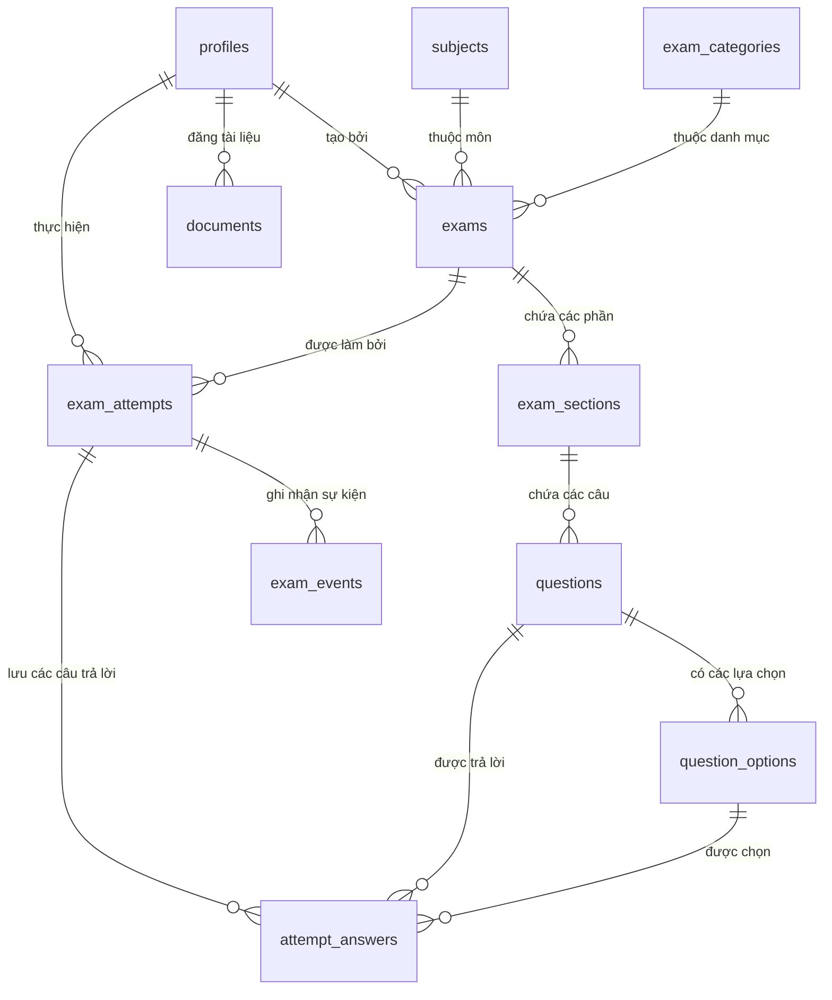

# Thiết Kế Cơ Sở Dữ Liệu (Database Schema)

- **Ngày cập nhật**: 2026-08-22
- **Phiên bản**: 1.0
- **Trạng thái**: Đã áp dụng & Kiểm thử hoàn chỉnh (18 migrations)

---

## Mục Lục

1. [Tổng quan kiến trúc dữ liệu](#1-tổng-quan-kiến-trúc-dữ-liệu)
2. [Sơ đồ quan hệ thực thể (Mermaid ERD)](#2-sơ-đồ-quan-hệ-thực-thể-mermaid-erd)
3. [Các kiểu dữ liệu Enum](#3-các-kiểu-dữ-liệu-enum)
4. [Chi tiết các bảng dữ liệu](#4-chi-tiết-các-bảng-dữ-liệu)
5. [Các View và Stored Procedures (RPC)](#5-các-view-và-stored-procedures-rpc)
6. [Các Trigger tự động hóa](#6-các-trigger-tự-động-hóa)
7. [Chiến lược chỉ mục (Indexes) cho 100 người dùng đồng thời](#7-chiến-lược-chỉ-mục-indexes-cho-100-người-dùng-đồng-thời)

---

## 1. Tổng Quan Kiến Trúc Dữ Liệu

Cơ sở dữ liệu được xây dựng trên nền tảng **PostgreSQL (Supabase)**, tận dụng các tính năng nâng cao như **Row Level Security (RLS)**, **PL/pgSQL Functions**, **Database Triggers** và các ràng buộc toàn vẹn dữ liệu.

- **Quản lý danh tính & Người dùng**: `auth.users` đóng vai trò nguồn xác thực gốc; bảng `profiles` lưu trữ thông tin mở rộng, vai trò (`role`) và trạng thái tài khoản (`status`).
- **Quản lý nội dung thi**: Phân cấp theo cấu trúc `subjects` (Môn học) -> `exam_categories` (Danh mục) -> `exams` (Đề thi) -> `exam_sections` (Phần thi) -> `questions` (Câu hỏi) -> `question_options` (Đáp án lựa chọn).
- **Phòng thi & Lịch sử làm bài**: Quản lý bằng `exam_attempts` (Lượt thi), `attempt_answers` (Câu trả lời chi tiết), `exam_events` (Nhật ký sự kiện phòng thi).
- **Thư viện tài liệu**: Bảng `documents` lưu trữ tài liệu số và học liệu ôn tập.

---

## 2. Sơ Đồ Quan Hệ Thực Thể (Mermaid ERD)

---

## 3. Các Kiểu Dữ Liệu Enum

| Tên Enum | Danh sách giá trị | Mục đích sử dụng |
| --- | --- | --- |
| `profile_role` | `'student'`, `'admin'` | Phân loại vai trò người dùng |
| `profile_status` | `'active'`, `'locked'` | Trạng thái hoạt động tài khoản học sinh |
| `exam_status` | `'draft'`, `'published'`, `'closed'`, `'archived'` | Vòng đời xuất bản của đề thi |
| `exam_access_type` | `'public'`, `'students_only'`, `'private'` | Mức độ giới hạn quyền tiếp cận đề |
| `attempt_status` | `'in_progress'`, `'submitted'`, `'auto_submitted'`, `'expired'` | Trạng thái của một lượt thi |
| `submit_reason` | `'student_submit'`, `'time_expired'`, `'fullscreen_violation'`, `'account_locked'`, `'system_recovery'` | Lý do kết thúc lượt thi |
| `exam_event_type` | `'attempt_started'`, `'answer_saved'`, `'fullscreen_exit'`, `'visibility_hidden'`, `'fullscreen_return'`, `'visibility_visible'`, `'fullscreen_unsupported'`, `'violation_resolved'`, `'account_locked'`, `'auto_submit_requested'`, `'submit_requested'`, `'submit_completed'`, `'network_recovered'` | Loại sự kiện diễn ra trong phòng thi |
| `document_status` | `'draft'`, `'published'`, `'archived'` | Trạng thái tài liệu ôn tập |

---

## 4. Chi Tiết Các Bảng Dữ Liệu

### 4.1. Bảng `profiles` (Hồ sơ người dùng)
| Tên cột | Kiểu dữ liệu | Nullable | Ràng buộc / Mặc định | Ý nghĩa |
| --- | --- | --- | --- | --- |
| `id` | `uuid` | NO | PK, FK `auth.users(id)` | Mã định danh người dùng |
| `role` | `profile_role` | NO | Default `'student'` | Vai trò người dùng |
| `status` | `profile_status` | NO | Default `'active'` | Trạng thái tài khoản |
| `display_name` | `text` | YES |  | Tên hiển thị người dùng |
| `created_at` | `timestamptz` | NO | Default `now()` | Thời điểm tạo |
| `updated_at` | `timestamptz` | NO | Default `now()` | Thời điểm cập nhật |

### 4.2. Bảng `subjects` (Môn học) & `exam_categories` (Danh mục)
- `id` (`uuid`, PK)
- `name` (`text`, NOT NULL)
- `slug` (`text`, NOT NULL, UNIQUE)
- `description` (`text`, NULL)
- `is_active` (`boolean`, Default `true`)
- `created_by` / `updated_by` (`uuid`, FK `profiles`)
- `created_at` / `updated_at` / `deleted_at` (`timestamptz`)

### 4.3. Bảng `exams` (Đề thi)
| Tên cột | Kiểu dữ liệu | Nullable | Ràng buộc / Mặc định | Ý nghĩa |
| --- | --- | --- | --- | --- |
| `id` | `uuid` | NO | PK, Default `gen_random_uuid()` | Mã đề thi |
| `subject_id` | `uuid` | NO | FK `subjects(id)` | Môn học |
| `category_id` | `uuid` | YES | FK `exam_categories(id)` | Danh mục kỳ thi |
| `title` | `text` | NO |  | Tiêu đề đề thi |
| `slug` | `text` | NO | UNIQUE | Đường dẫn thân thiện |
| `description` | `text` | YES |  | Mô tả chi tiết |
| `status` | `exam_status` | NO | Default `'draft'` | Trạng thái đề thi |
| `access_type` | `exam_access_type` | NO | Default `'public'` | Quyền truy cập |
| `allow_guest_attempt` | `boolean` | NO | Default `false` | Cho phép khách làm bài |
| `duration_minutes` | `integer` | NO | Check `1..300` | Thời gian làm bài (phút) |
| `total_score` | `numeric(10,2)` | NO | Default `0` | Tổng điểm (tính toán tự động) |
| `randomize_questions` | `boolean` | NO | Default `false` | Xáo trộn câu hỏi |
| `randomize_options` | `boolean` | NO | Default `false` | Xáo trộn đáp án |
| `fullscreen_required`| `boolean` | NO | Default `true` | Bắt buộc toàn màn hình |
| `show_score_after_submit` | `boolean` | NO | Default `true` | Hiện điểm sau khi nộp |
| `show_answers_after_submit` | `boolean` | NO | Default `false` | Hiện đáp án đúng sau nộp |
| `show_solutions_after_submit` | `boolean` | NO | Default `false` | Hiện lời giải sau nộp |
| `published_at` / `closed_at` / `archived_at` | `timestamptz` | YES |  | Mốc thời gian trạng thái |
| `created_by` / `updated_by` | `uuid` | YES | FK `profiles(id)` | Người tạo / chỉnh sửa |
| `created_at` / `updated_at` / `deleted_at` | `timestamptz` | NO/NO/YES |  | Mốc thời gian hệ thống |

### 4.4. Bảng `exam_sections` (Phần thi)
- `id` (`uuid`, PK)
- `exam_id` (`uuid`, NOT NULL, FK `exams(id)`)
- `title` (`text`, NOT NULL)
- `description` (`text`, NULL)
- `position` (`integer`, NOT NULL)
- `created_at` / `updated_at` / `deleted_at` (`timestamptz`)
- Ràng buộc: `UNIQUE(exam_id, position) WHERE deleted_at IS NULL`

### 4.5. Bảng `questions` (Câu hỏi)
- `id` (`uuid`, PK)
- `section_id` (`uuid`, NOT NULL, FK `exam_sections(id)`)
- `content` (`text`, NOT NULL)
- `image_path` (`text`, NULL) - Đường dẫn ảnh hoặc URL ảnh minh họa
- `explanation` (`text`, NULL) - Lời giải chi tiết
- `score` (`numeric(10,2)`, Default `1.00`, Check `score > 0`)
- `position` (`integer`, NOT NULL)
- `is_active` (`boolean`, Default `true`)
- `created_at` / `updated_at` / `deleted_at` (`timestamptz`)
- Ràng buộc: `UNIQUE(section_id, position) WHERE deleted_at IS NULL`

### 4.6. Bảng `question_options` (Lựa chọn câu trả lời)
- `id` (`uuid`, PK)
- `question_id` (`uuid`, NOT NULL, FK `questions(id)`)
- `content` (`text`, NOT NULL)
- `position` (`integer`, NOT NULL)
- `is_correct` (`boolean`, NOT NULL, Default `false`)
- `is_active` (`boolean`, Default `true`)
- `created_at` / `updated_at` / `deleted_at` (`timestamptz`)
- Ràng buộc: `UNIQUE(question_id, position) WHERE deleted_at IS NULL`

### 4.7. Bảng `exam_attempts` (Lượt thi)
| Tên cột | Kiểu dữ liệu | Nullable | Ý nghĩa |
| --- | --- | --- | --- |
| `id` | `uuid` | NO | PK, Mã lượt thi |
| `exam_id` | `uuid` | NO | FK `exams(id)` |
| `student_id` | `uuid` | YES | FK `profiles(id)` (Null nếu là Guest) |
| `guest_session_hash`| `text` | YES | Hash phiên khách 64 ký tự |
| `status` | `attempt_status` | NO | Trạng thái lượt thi |
| `started_at` | `timestamptz` | NO | Thời điểm bắt đầu thi (Server time) |
| `deadline_at` | `timestamptz` | NO | Hạn chót nộp bài (Server time) |
| `submitted_at` | `timestamptz` | YES | Thời điểm nộp bài thực tế |
| `submit_reason` | `submit_reason` | YES | Lý do hoàn thành |
| `score` / `max_score`| `numeric(10,2)`| YES | Điểm số đạt được / Điểm tối đa |
| `correct_answers` / `wrong_answers` / `blank_answers` | `integer` | YES | Thống kê số lượng câu hỏi |
| `idempotency_key` | `text` | YES | Khóa chống nộp trùng lặp |
| `finalized_at` | `timestamptz` | YES | Thời điểm chốt điểm bất biến |

### 4.8. Bảng `attempt_answers` (Câu trả lời chi tiết)
- `id` (`uuid`, PK)
- `attempt_id` (`uuid`, NOT NULL, FK `exam_attempts(id)`)
- `question_id` (`uuid`, NOT NULL, FK `questions(id)`)
- `selected_option_id` (`uuid`, NULL, FK `question_options(id)`)
- `is_marked` (`boolean`, NOT NULL, Default `false`)
- `answered_at` (`timestamptz`, NOT NULL)
- Ràng buộc: `UNIQUE(attempt_id, question_id)` (đảm bảo mỗi câu hỏi chỉ có 1 câu trả lời trong 1 bài thi).

### 4.9. Bảng `exam_events` (Sự kiện phòng thi)
- `id` (`uuid`, PK)
- `attempt_id` (`uuid`, NOT NULL, FK `exam_attempts(id)`)
- `event_type` (`exam_event_type`, NOT NULL)
- `client_occurred_at` (`timestamptz`, NULL)
- `server_occurred_at` (`timestamptz`, NOT NULL, Default `now()`)
- `metadata` (`jsonb`, NOT NULL, Default `'{}'`)
- `resolved_at` (`timestamptz`, NULL)

---

## 5. Các View Và Stored Procedures (RPC)

### View: `public.public_exam_catalog`
Cung cấp dữ liệu catalog an toàn cho trang chủ và thư viện đề thi:
- Tự động đếm `question_count` từ các câu hỏi active.
- Kết nối an toàn với bảng `subjects` và `exam_categories`.
- Ẩn hoàn toàn câu hỏi, đáp án đúng và giải thích chi tiết.

### Các Stored Procedures cốt lõi:
1. `publish_exam(exam_id uuid)`: Kiểm tra tính hợp lệ của đề thi (phải có section, question, và chính xác 1 đáp án đúng mỗi câu), tự động tính tổng `total_score` và chuyển sang `published`.
2. `delete_exam(p_exam_id uuid)`: Xóa mềm đề thi kèm xóa mềm liên đới toàn bộ sections, questions, options và tự động kết thúc (expire) các bài thi đang diễn ra.
3. `return_exam_to_draft(exam_id uuid)`: Cho phép chuyển đề thi từ `published`, `closed` hoặc `archived` về `draft`.
4. `clone_exam(source_exam_id uuid, new_title text, new_slug text)`: Tạo bản sao độc lập của đề thi với ID các câu hỏi và lựa chọn hoàn toàn mới.
5. `admin_lock_student(target_student_id uuid)`: Khóa tài khoản học sinh và tự động nộp bài thi đang làm dở với lý do `account_locked`.
6. `admin_unlock_student(target_student_id uuid)`: Mở khóa tài khoản học sinh.
7. `admin_reset_attempt(target_attempt_id uuid)`: Hủy bỏ bài làm để học sinh có thể thực hiện lại.

---

## 6. Các Trigger Tự Động Hóa

1. `set_updated_at`: Tự động gán `updated_at = now()` trước mỗi lệnh `UPDATE` trên tất cả các bảng.
2. `protect_exam_update`: Ngăn chặn việc chỉnh sửa các thông tin làm thay đổi cấu trúc điểm số trên đề thi đã xuất bản (cho phép xóa mềm).
3. `assert_exam_draft_for_content`: Bảo vệ nội dung phần thi, câu hỏi và đáp án chỉ được chỉnh sửa khi đề thi ở trạng thái `draft` (cho phép thao tác xóa mềm `deleted_at`).

---

## 7. Chiến Lược Chỉ Mục (Indexes) Cho 100 Người Dùng Đồng Thời

- **Chỉ mục tìm kiếm đề**:
  - `exams_status_access_idx`: `(status, access_type) WHERE deleted_at IS NULL`
  - `exams_title_search_idx`: Chỉ mục GIN Full-Text Search trên trường `title`
  - `exams_slug_active_unique`: Chỉ mục duy nhất không phân biệt hoa thường trên `lower(slug)`
- **Chỉ mục phòng thi & Autosave**:
  - `exam_attempts_student_active_unique`: `(student_id, exam_id) WHERE status = 'in_progress'`
  - `exam_attempts_guest_active_unique`: `(guest_session_hash, exam_id) WHERE status = 'in_progress'`
  - `attempt_answers(attempt_id, question_id)`: Phục vụ thao tác upsert đáp án tốc độ cao dưới 50ms
  - `exam_events(attempt_id, server_occurred_at)`: Theo dõi và xử lý vi phạm toàn màn hình tức thời.
