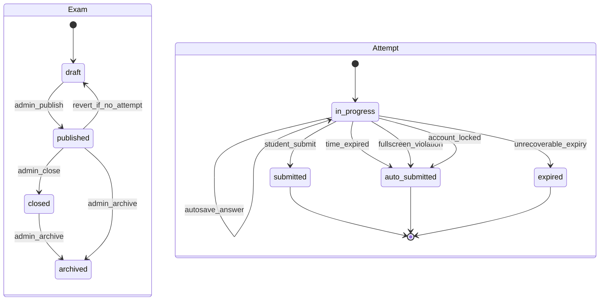

# Exam Lifecycle

- Ngay cap nhat: 2026-08-01
- Phien ban: 0.1
- Trang thai: Draft

## Muc Luc

1. Tong quan vong doi
2. Trang thai de thi va attempt
3. State machine
4. Quy tac bat dau/tiep tuc attempt
5. Quy tac khoa noi dung exam sau publish
6. Quy tac cau hoi, random va autosave
7. Quy tac refresh, nhieu tab, mat mang
8. Quy tac het gio, nop bai, cham diem
9. Race condition va xu ly
10. API/server action du kien
11. Truong hop bat buoc
12. Acceptance criteria

## 1. Tong Quan Vong Doi

Vong doi bat dau khi Admin tao de `draft`, them section/cau hoi/option, cau hinh thoi gian va quyen truy cap, sau do `published`. Noi dung anh huong ket qua bi khoa sau publish; neu exam da co attempt thi muon sua noi dung phai clone thanh exam moi `draft`. Student hoac Guest duoc phep tao `exam_attempts`. Trong khi attempt `in_progress`, client tai cau hoi khong co dap an dung, autosave dap an bang upsert, va submit bang API idempotent. Sau submit, server cham diem, khoa dap an, va hien ket qua/loi giai theo cau hinh exam.

## 2. Trang Thai

### De thi

| Trang thai | Mo ta |
| --- | --- |
| `draft` | Dang soan, chi Admin thay |
| `published` | Co the duoc Guest/Student truy cap theo `access_type` |
| `closed` | Khong cho attempt moi; attempt dang lam truoc do van tiep tuc den `deadline_at` |
| `archived` | Luu lich su, khong sua noi dung chinh |

### Attempt

| Trang thai | Mo ta |
| --- | --- |
| `in_progress` | Dang lam, co the autosave/submit |
| `submitted` | Student nop chu dong |
| `auto_submitted` | He thong nop do het gio, fullscreen violation, hoac account locked |
| `expired` | Chi dung khi attempt khong the cham hop le hoac du lieu/phien khong the khoi phuc; het gio binh thuong dung `auto_submitted` + `time_expired` |

## 3. State Machine

`closed` khong tao transition nao tu attempt `in_progress` sang `auto_submitted`; close exam chi chan attempt moi trong MVP.

## 4. Quy Tac Bat Dau/Tiep Tuc Attempt

- Dieu kien bat dau: exam `published`, user duoc phep theo `access_type`, Student `active`, Guest chi duoc neu `access_type = public` va `allow_guest_attempt = true`. `private` chi Admin preview trong MVP. Exam `closed` khong cho attempt moi.
- Neu `fullscreen_required = true`, client kiem tra ho tro Fullscreen API va goi `requestFullscreen()` tu user gesture thanh cong truoc khi goi `startAttempt`. Kiem tra nay chi xac dinh kha nang UI, khong phai bien phap bao mat server-side.
- Tao attempt bang server action/RPC sau khi dieu kien tren dat. Server dat `started_at = now()` va `deadline_at = started_at + duration_minutes`.
- Client khong gui `started_at`, `deadline_at`, `score`, `status`.
- Guest attempt: server tao signed guest token/cookie, luu hash vao `guest_session_hash`, va moi request sau phai so khop token nay.
- Tiep tuc attempt: chi cho owner attempt, status `in_progress`, `now() < deadline_at`. Neu qua deadline, server submit/expire truoc khi tra du lieu.
- Mot owner co the co nhieu attempt final cho cung mot exam trong MVP, nhung chi mot attempt `in_progress` moi exam. `startAttempt` chay trong transaction; neu hai request start dong thoi, unique partial index ngan attempt active thu hai va request thua doc/tra attempt active hien co.

## 5. Quy Tac Khoa Noi Dung Exam Sau Publish

- Admin duoc sua toan bo noi dung khi exam `draft`.
- Khi publish, server validate cau truc va tinh `total_score = sum(active questions.score)`; client khong duoc tu set `total_score`.
- Sau khi exam `published`, cac du lieu anh huong ket qua bi khoa: `exam_sections`, `questions`, `question_options`, `question_options.is_correct`, `questions.score`, thu tu section/question/option, `duration_minutes`, `randomize_questions`, `randomize_options`.
- Metadata co the sua sau publish trong MVP: `title`, `slug`, `description`, `access_type`, `allow_guest_attempt`, `fullscreen_required`, va cau hinh hien thi result/answer/solution.
- Exam `published` chua co attempt co the dua ve `draft` de sua noi dung.
- Exam da co it nhat mot attempt khong duoc dua ve `draft`; Admin phai clone exam thanh exam moi `draft` voi section/question/option ID moi. Exam cu giu nguyen de audit va attempt cu van cham theo noi dung cu.

## 6. Cau Hoi, Random Va Autosave

- Tai cau hoi qua API `getAttemptPayload(attemptId)` da kiem owner.
- Response gom cau hoi, option, dap an da luu, trang thai danh dau, `server_now`, `deadline_at`.
- Response khong gom `question_options.is_correct` va khong gom loi giai neu attempt chua nop.
- Random cau hoi/option: trong MVP mac dinh false va Admin UI khong cho bat. Neu can bat sau MVP, phai them co che luu thu tu on dinh cho tung attempt truoc khi publish.
- Autosave: client debounce khi thay doi, goi `upsertAttemptAnswer(attemptId, questionId, selectedOptionId, isMarked)`.
- Server chi upsert neu attempt `in_progress`, owner hop le, Student chua bi khoa, attempt chua qua deadline, question thuoc section cua exam attempt, `selected_option_id` thuoc dung `question_id`, option active va chua soft delete. Neu bo chon dap an, `selected_option_id` co the null.
- Request saveAnswer loi khong duoc tao hoac cap nhat `attempt_answers`.
- Khong luu dong ho dem nguoc moi giay vao database.

## 7. Refresh, Nhieu Tab, Mat Mang

- Refresh: client goi lai payload; server tra dap an da luu va thoi gian con lai tinh tu `deadline_at - server_now`.
- Nhieu tab: moi request autosave hop le duoc chap nhan theo last-write-wins cho cung `attempt_id + question_id`; UI nen hien canh bao neu phat hien tab khac qua `localStorage`/BroadcastChannel. Server van la nguon su that.
- Mat mang khi autosave: client giu hang doi cuc bo ngan han va retry khi co mang. Neu attempt da qua deadline luc retry, server tu choi autosave va submit/expire.
- Mat mang khi vi pham fullscreen sau khi event da ghi server: request tiep theo hoac scheduled sweeper xac minh event unresolved qua 5 giay va final; thoi diem final co the muon hon giay thu 5.
- Mat mang truoc khi event toi server: server khong the biet chinh xac thoi diem thoat fullscreen. Client luu pending violation cuc bo va retry khi online; server dung `server_occurred_at` luc nhan event lam moc tin cay.

## 8. Het Gio, Nop Bai, Cham Diem

- Het gio: bat ky API attempt nao cung kiem `now() >= deadline_at`. Neu dung, server chuyen attempt thanh `auto_submitted` voi `submit_reason = time_expired`.
- Nop bai: API submit nhan `attempt_id` va optional `idempotency_key`; transaction lock row attempt bang co che tuong duong `SELECT ... FOR UPDATE`. Neu attempt da final, khong cham lai, khong doi `submitted_at`/`finalized_at`/`score`, va tra ket qua final hien co ke ca request dung key khac.
- Khi attempt `in_progress`, server xac minh owner, deadline, Student active, va submit reason. Cham diem, set status final, `submitted_at`, `finalized_at`, `score`, `max_score`, va ghi `idempotency_key` dau tien trong cung transaction.
- Cham diem: server doc `is_correct`, tinh diem theo `questions.score` cua noi dung exam da khoa, luu `score`, `max_score`, `submitted_at`.
- Sau khi attempt final, `attempt_answers` khong duoc insert/update/delete.
- Hien ket qua: theo `show_score_after_submit`, `show_answers_after_submit`, `show_solutions_after_submit`.

## 9. Race Condition Va Xu Ly

| Race condition | Cach xu ly |
| --- | --- |
| Hai request submit dong thoi | Transaction + row lock + idempotency; request sau tra ket qua da final |
| Autosave den sau submit | Server kiem status final va tu choi |
| Client submit dung luc het gio | Server uu tien `now() >= deadline_at`; `submit_reason = time_expired` neu qua han |
| Admin dong de khi Student dang lam | Khong tao attempt moi; attempt dang lam van tiep tuc autosave/submit den `deadline_at` |
| Fullscreen timer client cham | Server so sanh `server_occurred_at` event chua resolve |
| Refresh tao attempt moi | Start API tra attempt `in_progress` hien co cho cung owner + exam |
| Nhieu tab ghi hai dap an | Unique + upsert last-write-wins, ghi `updated_at` |
| Retry submit sau loi mang | Idempotency key tra ket qua cu |
| Scheduled job het gio va submit tay cung luc | Ca hai dung cung transaction/row lock; request sau tra attempt final |
| Tai khoan bi khoa khi dang lam | Server auto-submit attempt `in_progress` voi `submit_reason = account_locked`; chi cham answer da ack truoc luc khoa |
| Hai request start dong thoi | Transaction + unique partial active attempt; request thua doc attempt active hien co |
| Fullscreen exit va tab hidden gan nhau | Server chi giu mot unresolved violation active; event sau chi bo sung metadata/log, khong mo countdown moi |

## 10. API Hoac Server Action Du Kien

| API | Input | Output | Ghi chu |
| --- | --- | --- | --- |
| `startAttempt(examId)` | `examId`, optional guest token | `attemptId`, `startedAt`, `deadlineAt` | Server tao timestamp |
| `getAttemptPayload(attemptId)` | `attemptId` | Cau hoi, option an dap an dung, answers, `serverNow` | Kiem owner |
| `saveAnswer(attemptId, questionId, selectedOptionId, isMarked)` | Dap an | Answer da luu | Upsert |
| `recordExamEvent(attemptId, eventType, clientOccurredAt, metadata)` | Event | Event id, server time | Fullscreen/visibility |
| `resolveExamEvent(eventId)` | Event id | Resolved event | Khi quay lai fullscreen |
| `submitAttempt(attemptId, idempotencyKey, reason)` | Reason hop le | Attempt final + result allowed | Idempotent |
| `getAttemptResult(attemptId)` | `attemptId` | Ket qua theo config | Khong lo du lieu neu bi tat |
| `cloneExam(examId)` | `examId` | Exam moi `draft` | Chi khi exam da co attempt va Admin can sua noi dung |

## 11. Truong Hop Bat Buoc

1. Student bat dau de fullscreen_required: client vao fullscreen thanh cong tu user gesture, sau do server tao attempt/deadline.
2. Student refresh khi dang thi: payload phuc hoi dap an va thoi gian server-based.
3. Student mo cung bai tren hai tab: server khong nhan doi attempt active; autosave last-write-wins; UI canh bao.
4. Student mat mang khi luu dap an: retry; neu qua han thi autosave bi tu choi.
5. Student bam nop hai lan: chi mot submit duoc cham, request sau tra final result.
6. Het gio khi Student offline: request tiep theo hoac scheduled job chuyen `auto_submitted`.
7. Client sua dong ho: vo hieu vi server dung `deadline_at`.
8. Student goi API cua nguoi khac: RLS/API tra 403/404.
9. Student quay lai attempt da nop: chi xem result, khong vao man hinh lam bai.
10. Admin dong de luc Student dang lam: attempt dang lam van tiep tuc den deadline; close chi chan attempt moi.
11. Browser crash: sau khi mo lai, payload phuc hoi theo `deadline_at`; neu qua han server final truoc khi tra result.
12. Guest lam de: chi tiep tuc/xem result khi signed guest token khop `guest_session_hash`.
13. Admin khoa Student dang thi: attempt auto-submit voi `submit_reason = account_locked`, chi cham answer da server ack.
14. Admin sua noi dung exam da co attempt: bi tu choi; clone exam tao ban `draft` moi.

## 12. Acceptance Criteria

- AC-LIFE-001: Attempt moi co `started_at` va `deadline_at` do server tao.
- AC-LIFE-002: Client khong thay `is_correct` truoc submit.
- AC-LIFE-003: Refresh khong mat dap an da autosave.
- AC-LIFE-004: Submit hai lan khong cham trung.
- AC-LIFE-005: Qua deadline thi khong luu dap an moi.
- AC-LIFE-006: Attempt final khong sua duoc answer.
- AC-LIFE-007: Moi race condition trong bang co test tuong ung tai [acceptance-tests.md](./acceptance-tests.md).
- AC-LIFE-008: Start attempt khong tao attempt active thu hai cho cung owner + exam.
- AC-LIFE-009: Browser crash/refresh sau deadline tra attempt final, khong cho tiep tuc lam.
- AC-LIFE-010: Exam da publish va co attempt khong sua duoc noi dung anh huong ket qua.
- AC-LIFE-011: Close exam khong auto-submit attempt dang lam.
- AC-LIFE-012: `saveAnswer` tu choi option/question khong thuoc exam attempt.
