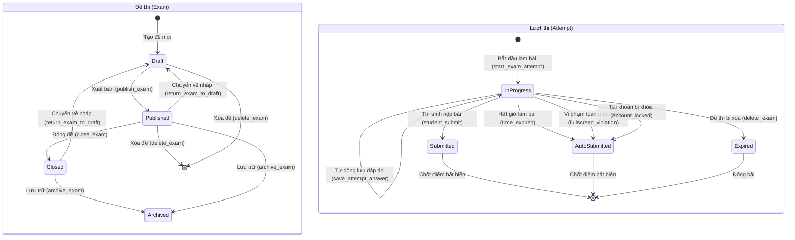
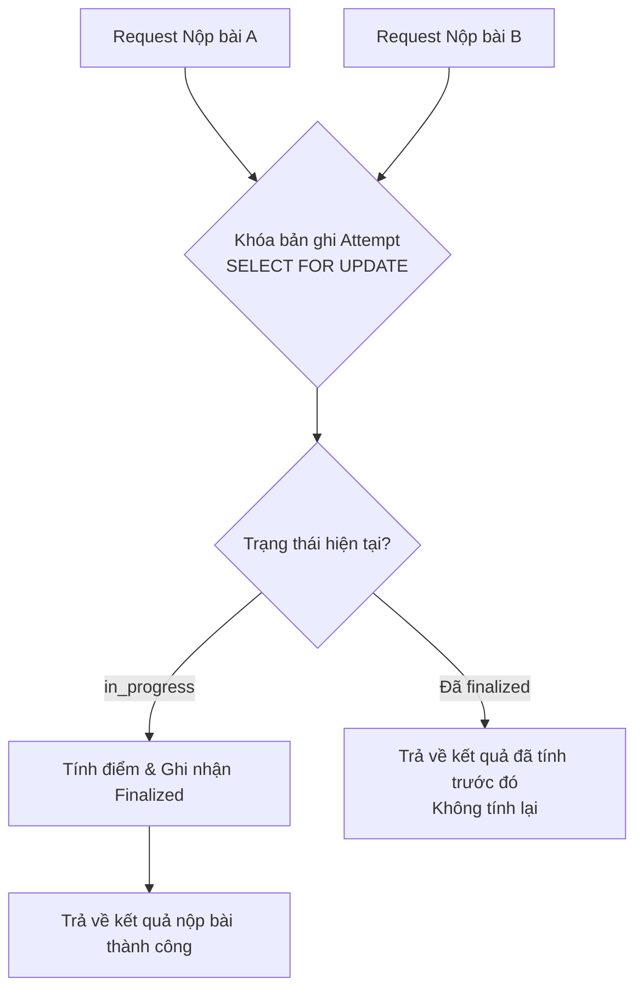

# Vòng Đời Bài Thi & Máy Trạng Thái (Exam Lifecycle)

- **Ngày cập nhật**: 2026-08-22
- **Phiên bản**: 1.0
- **Trạng thái**: Đã nghiệm thu & Hoạt động

---

## Mục Lục

1. [Tổng quan vòng đời](#1-tổng-quan-vòng-đời)
2. [Các trạng thái của Đề thi & Lượt thi](#2-các-trạng-thái-của-đề-thi--lượt-thi)
3. [Sơ đồ máy trạng thái (State Machine Diagram)](#3-sơ-đồ-máy-trạng-thái-state-machine-diagram)
4. [Quy trình khởi tạo & Tiếp tục bài thi](#4-quy-trình-khởi-tạo--tiếp-tục-bài-thi)
5. [Quy tắc bảo vệ nội dung đề thi đã xuất bản](#5-quy-tắc-bảo-vệ-nội-dung-đề-thi-đã-xuất-bản)
6. [Cơ chế lưu đáp án tự động (Idempotent Autosave)](#6-cơ-chế-lưu-đáp-án-tự-động-idempotent-autosave)
7. [Xử lý mất kết nối, tải lại trang & đa tab](#7-xử-lý-mất-kết-nối-tải-lại-trang--đa-tab)
8. [Quy trình nộp bài, hết giờ & Chấm điểm](#8-quy-trình-nộp-bài-hết-giờ--chấm-điểm)
9. [Xử lý tranh chấp dữ liệu (Race Conditions)](#9-xử-lý-tranh-chấp-dữ-liệu-race-conditions)
10. [Danh mục API & Server Actions cốt lõi](#10-danh-mục-api--server-actions-cốt-lõi)

---

## 1. Tổng Quan Vòng Đời

Vòng đời bài thi bao gồm hai chu kỳ song song và tương hỗ:
1. **Chu kỳ đề thi (Exam Lifecycle)**: Bắt đầu từ khi Quản trị viên khởi tạo bản nháp (`draft`), phân chia phần thi, thêm câu hỏi, tải ảnh minh họa, sau đó xuất bản (`published`). Đề thi có thể chuyển sang đóng thi (`closed`), lưu trữ (`archived`), hoặc xóa bỏ với cơ chế xóa mềm liên đới (`delete_exam`).
2. **Chu kỳ lượt thi (Attempt Lifecycle)**: Bắt đầu khi Thí sinh kích hoạt chế độ toàn màn hình và tạo lượt thi (`startAttempt`). Trong quá trình làm bài, các câu trả lời được lưu tức thời (Autosave). Lượt thi kết thúc khi thí sinh nộp bài chủ động (`submitted`), hết giờ thi (`auto_submitted` do `time_expired`), hoặc vi phạm quy định toàn màn hình (`auto_submitted` do `fullscreen_violation`). Máy chủ sẽ chốt điểm số và lưu trữ bất biến.

---

## 2. Các Trạng Thái Của Đề Thi & Lượt Thi

### 2.1. Trạng thái Đề thi (`exams.status`)

| Trạng thái | Ý nghĩa & Hành vi |
| --- | --- |
| `draft` (Bản nháp) | Đang biên soạn, chỉ Quản trị viên nhìn thấy. Có thể tự do thêm/sửa/xóa phần thi, câu hỏi, đáp án |
| `published` (Đã xuất bản) | Hiển thị trên thư viện đề thi theo `access_type`. Thí sinh có thể bắt đầu làm bài. Nội dung câu hỏi và điểm số được khóa |
| `closed` (Đóng thi) | Ngăn chặn thí sinh bắt đầu lượt thi mới. Các thí sinh đang làm dở vẫn được tiếp tục làm bài cho đến hết giờ |
| `archived` (Lưu trữ) | Lưu trữ lịch sử, không xuất hiện trên trang danh mục chính |

### 2.2. Trạng thái Lượt thi (`exam_attempts.status`)

| Trạng thái | Ý nghĩa & Hành vi |
| --- | --- |
| `in_progress` (Đang làm) | Bài thi đang diễn ra, đồng hồ đếm ngược hoạt động, cho phép lưu đáp án |
| `submitted` (Đã nộp) | Thí sinh chủ động nộp bài thành công trước khi hết giờ |
| `auto_submitted` (Tự động nộp) | Hệ thống tự động thu bài và chấm điểm do hết giờ, vi phạm toàn màn hình hoặc tài khoản bị khóa |
| `expired` (Hết hạn) | Dùng cho các lượt thi bị đóng khi đề thi bị xóa hoặc không thể phục hồi |

---

## 3. Sơ Đồ Máy Trạng Thái (State Machine Diagram)

---

## 4. Quy Trình Khởi Tạo & Tiếp Tục Bài Thi

1. **Điều kiện bắt đầu**:
   - Đề thi ở trạng thái `published` và chưa bị xóa mềm (`deleted_at IS NULL`).
   - Quyền truy cập thỏa mãn: Khách đối với đề `public` có `allow_guest_attempt = true`; Học sinh với đề `public` hoặc `students_only`.
   - Tài khoản học sinh ở trạng thái `active`.
2. **Kích hoạt toàn màn hình**:
   - Nếu `fullscreen_required = true`, giao diện hiển thị bảng hướng dẫn và yêu cầu thí sinh nhấn xác nhận để gọi `requestFullscreen()` từ thao tác người dùng (user gesture).
3. **Tạo lượt thi**:
   - Sau khi vào toàn màn hình thành công, gọi RPC `start_exam_attempt`.
   - Máy chủ gán `started_at = now()` và `deadline_at = started_at + (duration_minutes * interval '1 minute')`.
   - Nếu thí sinh đã có một bài thi `in_progress` chưa hoàn thành cho đề thi này, hệ thống sẽ trả về chính bài thi đó thay vì tạo bài mới.

---

## 5. Quy Tắc Bảo Vệ Nội Dung Đề Thi Đã Xuất Bản

- **Khi đề ở trạng thái `draft`**: Quản trị viên toàn quyền chỉnh sửa phần thi, câu hỏi, điểm số, ảnh minh họa, đáp án đúng và thời gian làm bài.
- **Khi đề ở trạng thái `published`**:
  - Database trigger `protect_exam_update` và `assert_exam_draft_for_content` sẽ chặn mọi thao tác cập nhật điểm số, thay đổi đáp án đúng hoặc sửa cấu trúc câu hỏi.
  - Quản trị viên được phép sửa các thông tin hiển thị cơ bản (tiêu đề, mô tả, cấu hình hiển thị lời giải sau khi nộp).
- **Trường hợp muốn sửa nội dung đề đã xuất bản**:
  - Cách 1: Sử dụng chức năng **Nhân bản đề thi (Clone Exam)** để tạo một bản sao mới độc lập ở trạng thái `draft`.
  - Cách 2: Sử dụng chức năng **Chuyển về bản nháp (Return to Draft)** nếu đề thi chưa có lượt thi thực tế nào.

---

## 6. Cơ Chế Lưu Đáp Án Tự Động (Idempotent Autosave)

- Khi thí sinh chọn đáp án, client áp dụng kỹ thuật debounce (300ms) và gọi RPC `save_attempt_answer`.
- Đáp án được lưu vào bảng `attempt_answers` theo cơ chế `ON CONFLICT (attempt_id, question_id) DO UPDATE`.
- Máy chủ xác thực nghiêm ngặt:
  - Lượt thi phải thuộc về thí sinh và đang ở trạng thái `in_progress`.
  - Thời gian hiện tại chưa vượt quá `deadline_at`.
  - Câu hỏi và đáp án lựa chọn phải thuộc về đề thi của lượt thi này và đang hoạt động (`is_active = true`, `deleted_at IS NULL`).

---

## 7. Xử Lý Mất Kết Nối, Tải Lại Trang & Đa Tab

| Tình huống | Cơ chế xử lý |
| --- | --- |
| **Tải lại trang (F5 / Refresh)** | Client tải lại toàn bộ câu hỏi và khôi phục 100% các câu trả lời đã lưu từ database; đồng hồ tiếp tục đếm ngược theo thời gian server |
| **Mất kết nối mạng tạm thời** | Client lưu hàng đợi đáp án cục bộ và tự động gửi lại khi có mạng; nếu khi có mạng mà đã quá `deadline_at`, hệ thống sẽ tự động thu bài |
| **Mở bài thi trên nhiều tab** | Cơ chế `upsert` trên máy chủ xử lý theo nguyên tắc thao tác sau cùng ghi đè (last-write-wins); giao diện đồng bộ trạng thái qua `BroadcastChannel` |
| **Đột ngột tắt trình duyệt / Crash** | Bài thi vẫn duy trì trên máy chủ; thí sinh mở lại trình duyệt trong thời gian thi vẫn tiếp tục làm bài bình thường |

---

## 8. Quy Trình Nộp Bài, Hết Giờ & Chấm Điểm

1. **Nộp bài chủ động**: Thí sinh nhấn "Nộp bài", hệ thống hiển thị hộp thoại xác nhận số câu đã làm và số câu chưa làm, sau đó gọi `submit_exam_attempt(submit_reason = 'student_submit')`.
2. **Hết giờ làm bài**: Khi đồng hồ đếm ngược về 0 hoặc máy chủ phát hiện `now() >= deadline_at`, hệ thống tự động khóa bài với `submit_reason = 'time_expired'`.
3. **Quy trình chấm điểm máy chủ (Server-side Scoring)**:
   - Khóa bản ghi lượt thi bằng `SELECT ... FOR UPDATE` để chống nộp bài trùng lặp.
   - So khớp các câu trả lời trong `attempt_answers` với đáp án đúng (`is_correct = true`) trong `question_options`.
   - Tính toán tổng điểm đạt được (`score`), điểm tối đa (`max_score`), số câu đúng/sai/bỏ qua.
   - Cập nhật trạng thái lượt thi thành `submitted` hoặc `auto_submitted` và ghi nhận `finalized_at = now()`.

---

## 9. Xử Lý Tranh Chấp Dữ Liệu (Race Conditions)

- **Hai request nộp bài cùng lúc**: Request đầu tiên chiếm khóa hàng và tính điểm; request thứ hai nhận kết quả đã chốt mà không tính điểm lần hai.
- **Lưu đáp án đến sau khi đã nộp bài**: Máy chủ kiểm tra trạng thái khác `in_progress` và từ chối cập nhật.
- **Quản trị viên xóa đề khi có người đang thi**: Hàm `delete_exam` tự động chuyển các bài đang làm sang `expired` và lưu trữ an toàn.

---

## 10. Danh Mục API & Server Actions Cốt Lõi

| Tên Action / RPC | Tham số đầu vào | Kết quả trả về | Mục đích sử dụng |
| --- | --- | --- | --- |
| `startExamAttemptAction` | `examId`, `guestToken` | `attemptId`, `startedAt`, `deadlineAt` | Bắt đầu làm bài thi |
| `saveAnswerAction` | `attemptId`, `questionId`, `optionId`, `isMarked` | `ok`, `message` | Lưu đáp án tự động |
| `submitExamAttemptAction` | `attemptId`, `idempotencyKey`, `reason` | `ok`, `attemptId`, `score` | Nộp bài và chấm điểm |
| `publishExamAction` | `examId` | `ok`, `publishedExamId` | Xuất bản đề thi |
| `deleteExamAction` | `examId` | `ok`, `message` | Xóa đề thi liên đới an toàn |
| `cloneExamAction` | `sourceExamId`, `newTitle`, `newSlug` | `ok`, `clonedExamId` | Nhân bản đề thi |
