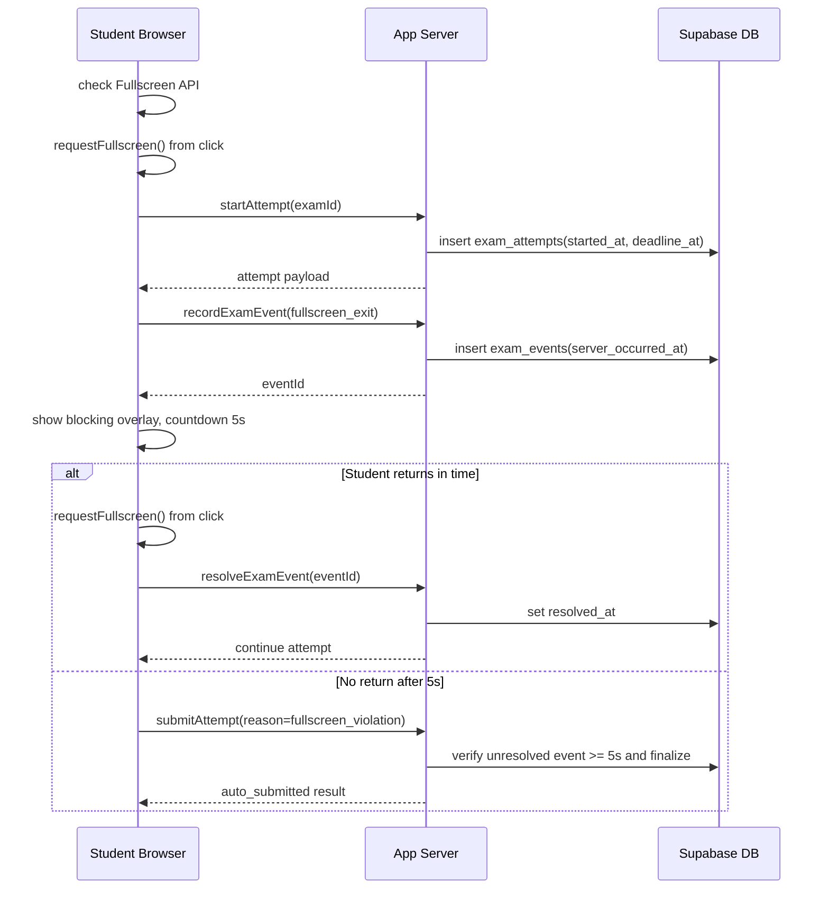

# Fullscreen Policy

- Ngay cap nhat: 2026-08-01
- Phien ban: 0.1
- Trang thai: Draft

## Muc Luc

1. Muc dich va gioi han
2. Thiet bi va trinh duyet
3. Kich hoat fullscreen
4. Xu ly event va overlay
5. Ghi nhan/xac minh phia server
6. Mat mang, refresh, nhieu tab
7. Pseudocode
8. Sequence diagram
9. Acceptance criteria
10. Test cases

## 1. Muc Dich Va Gioi Han

Che do toan man hinh giup giam viec Student roi khoi man hinh lam bai va tao tin hieu audit khi co hanh vi thoat fullscreen/chuyen tab. Day khong phai giai phap chong gian lan tuyet doi: trinh duyet khong cho website khoa he dieu hanh, ngan thiet bi khac, ngan chup anh, hoac bat buoc fullscreen tren moi mobile browser.

## 2. Thiet Bi Va Trinh Duyet

- Ho tro: Chrome, Edge, Firefox, Safari hien hanh tren desktop neu co Fullscreen API.
- Moi exam co cau hinh `fullscreen_required boolean not null default true`.
- Mobile: ho tro khong dong nhat; iOS Safari co gioi han rieng. Neu exam bat buoc fullscreen va thiet bi/browser khong ho tro Fullscreen API, khong cho bat dau attempt va hien thong bao de nghi dung Chrome hoac Edge tren may tinh.
- Neu `fullscreen_required = false`, nguoi dung duoc lam bai khong can fullscreen; thoat fullscreen/visibility hidden khong kich hoat auto-submit trong MVP.

## 3. Kich Hoat Fullscreen

- Khi Student bat dau bai thi, hien man hinh huong dan.
- Neu `fullscreen_required = true`, client kiem tra Fullscreen API va Student phai bam nut xac nhan de vao fullscreen truoc khi tao attempt.
- Thu tu MVP: kiem tra ho tro client -> `requestFullscreen()` tu user gesture -> thanh cong moi goi `startAttempt` -> server tao `started_at`/`deadline_at` -> client tai payload.
- Chi goi `element.requestFullscreen()` sau user gesture.
- Khong tu goi fullscreen khi page load, sau timeout, hoac sau retry khong co click.
- Neu request fullscreen that bai va exam bat buoc fullscreen, hien loi ro rang, khong vao man hinh lam bai, va khong tao attempt nen dong ho chua bat dau.
- Neu `fullscreen_required = false`, bo qua buoc request fullscreen va goi `startAttempt` binh thuong.

## 4. Xu Ly Event Va Overlay

- Chi ap dung vi pham fullscreen/visibility khi `fullscreen_required = true`.
- Lang nghe `fullscreenchange`: neu `document.fullscreenElement` null khi attempt `in_progress`, bat dau vi pham.
- Lang nghe `visibilitychange`: neu `document.visibilityState = hidden`, ghi event va xu ly nhu roi khoi bai.
- Mot attempt chi co mot unresolved violation active tai mot thoi diem. Neu `fullscreen_exit` va `visibility_hidden` xay ra gan nhau, event thu hai co the ghi metadata/log nhung khong tao countdown rieng.
- Overlay canh bao phai chan toan bo thao tac lam bai.
- Noi dung canh bao can ro: "Ban da roi khoi che do toan man hinh. Hay bam Quay lai toan man hinh trong 5 giay de tiep tuc bai thi."
- Thoi gian an han: 5 giay.
- Overlay hien khi Student quay lai tab neu violation dang active. Khong tu resolve chi vi tab tro lai visible.
- Huy canh bao khi Student bam nut quay lai fullscreen va request thanh cong trong 5 giay; sau do ghi `fullscreen_return`/`visibility_visible` neu can va event `violation_resolved`.
- Neu qua 5 giay chua quay lai, client goi submit voi `submit_reason = fullscreen_violation`.
- Khi attempt da nop, cleanup tat ca timer va event listener lien quan.
- Tranh timer cu tiep tuc chay bang cach luu `activeViolationId`, clear timeout/interval khi resolve hoac final.

## 5. Ghi Nhan Va Xac Minh Phia Server

- Khi phat hien thoat fullscreen/hidden, client goi `recordExamEvent`.
- Server ghi `server_occurred_at = now()`, khong tin tuyet doi `client_occurred_at`.
- Khi Student quay lai, client goi `resolveExamEvent`.
- Khi submit do fullscreen, server kiem tra co event `fullscreen_exit` hoac `visibility_hidden` chua resolve, va `now() - server_occurred_at >= 5 seconds`.
- Neu qua han, server chuyen attempt thanh `auto_submitted`, `submit_reason = fullscreen_violation`.
- Neu chua qua han, server tu choi auto-submit va tra thoi gian con lai.

## 6. Mat Mang, Refresh, Nhieu Tab

- Online: client ghi event, overlay dem 5 giay, neu khong quay lai thi goi `submitAttempt`; server xac minh event chua resolve va du 5 giay theo `server_occurred_at`.
- Mat mang sau khi event da ghi server: client co the khong submit dung giay thu 5. Khi co request tiep theo hoac scheduled sweeper chay, server xac minh event qua han va final attempt. Thoi diem final co the muon hon 5 giay; Student khong duoc tiep tuc lam sau reconnect neu event da qua han.
- Mat mang truoc khi event toi server: server khong the biet chinh xac thoi diem thoat fullscreen. Client luu pending violation trong local/session storage va retry khi online; server dung thoi diem nhan event lam can cu tin cay. Day la gioi han ky thuat cua web browser.
- Refresh khi overlay dang bat: sau load, server kiem event chua resolve; neu qua 5 giay thi final attempt.
- Nhieu tab: tab nao phat hien `visibility_hidden`/fullscreen exit deu ghi event. BroadcastChannel/localStorage dung de thong bao tab khac, nhung server moi la nguon su that.
- Tranh submit nhieu lan: submit API idempotent; client dung flag `isSubmitting` va idempotency key.
- Scheduled sweeper chi la co che recovery cho unresolved violation; khong hua chay chinh xac moi 5 giay.

## 7. Pseudocode

### Client

```ts
let activeViolationId: string | null = null
let violationTimer: number | null = null
let isFinal = false

async function enterFullscreenFromClick() {
  if (!exam.fullscreenRequired) {
    await startAttempt()
    return
  }
  if (!document.fullscreenEnabled) throw new Error("FULLSCREEN_UNSUPPORTED")
  await examRoot.requestFullscreen()
  await startAttempt()
}

async function beginViolation(eventType: "fullscreen_exit" | "visibility_hidden") {
  if (isFinal || activeViolationId) return
  const event = await recordExamEvent({ attemptId, eventType, clientOccurredAt: new Date() })
  activeViolationId = event.id
  showBlockingOverlay(5)
  violationTimer = window.setTimeout(() => submitForViolation(), 5000)
}

async function returnToFullscreenFromClick() {
  await examRoot.requestFullscreen()
  if (activeViolationId) await resolveExamEvent(activeViolationId)
  clearViolationState()
}

async function submitForViolation() {
  if (isFinal) return
  isFinal = true
  await submitAttempt({ attemptId, idempotencyKey, reason: "fullscreen_violation" })
  cleanupFullscreenListeners()
}
```

### Server

```ts
async function submitAttempt(input) {
  return transaction(async (tx) => {
    const attempt = await tx.lockAttempt(input.attemptId)
    if (attempt.status !== "in_progress") return attempt

    if (input.reason === "fullscreen_violation") {
      const event = await tx.findUnresolvedViolation(attempt.id)
      if (!event || now() - event.server_occurred_at < 5_000) {
        throw new Error("VIOLATION_GRACE_PERIOD_ACTIVE")
      }
    }

    return tx.finalizeAndScoreAttempt(attempt.id, "auto_submitted", input.reason)
  })
}
```

## 8. Sequence Diagram



## 9. Acceptance Criteria

- AC-FULL-001: Overlay chan thao tac cau hoi khi thoat fullscreen.
- AC-FULL-002: Countdown dung 5 giay.
- AC-FULL-003: Student phai bam nut de quay lai fullscreen; khong tu request fullscreen.
- AC-FULL-004: Quay lai trong 5 giay tiep tuc attempt va event duoc resolve.
- AC-FULL-005: Qua 5 giay attempt thanh `auto_submitted` voi `submit_reason = fullscreen_violation`.
- AC-FULL-006: Server xac minh event chua resolve va thoi gian server.
- AC-FULL-007: Sau final, timer/listener duoc cleanup.
- AC-FULL-008: Exam `fullscreen_required = true` khong tao attempt neu browser khong ho tro hoac request fullscreen bi reject.
- AC-FULL-009: Exam `fullscreen_required = false` khong auto-submit do thoat fullscreen/hidden.
- AC-FULL-010: Fullscreen exit va visibility hidden gan nhau chi tao mot active violation.

## 10. Test Cases

| Ma | Given | When | Then | Loai |
| --- | --- | --- | --- | --- |
| TC-FULL-001 | Exam fullscreen_required, browser ho tro | Bam bat dau va fullscreen thanh cong | Attempt duoc tao sau fullscreen, deadline server | E2E |
| TC-FULL-002 | Overlay dang dem | Bam quay lai trong 5 giay | Overlay dong, event resolved | E2E |
| TC-FULL-003 | Overlay dang dem | Khong quay lai | Submit auto, status `auto_submitted` | E2E/Integration |
| TC-FULL-004 | Client sua timer thanh 60s | Qua 5s server | Server van auto-submit | Integration |
| TC-FULL-005 | Mat mang sau khi event da ghi | Ket noi lai sau 5s | Server auto-submit khi co request/recovery, khong yeu cau dung giay thu 5 | E2E |
| TC-FULL-006 | Exam fullscreen_required, browser khong ho tro | Bat dau bai | Hien loi, khong tao attempt | E2E |
| TC-FULL-007 | Nop bai do vi pham bi retry | Hai request submit | Chi mot ket qua final | Integration |
| TC-FULL-008 | Exam khong bat buoc fullscreen | Thoat fullscreen/hidden | Khong auto-submit do fullscreen | E2E |
| TC-FULL-009 | Fullscreen exit va tab hidden gan nhau | Ca hai event xay ra | Chi mot active violation va mot countdown | Integration/E2E |
| TC-FULL-010 | Mat mang truoc khi event toi server | Reconnect va retry pending event | Server dung thoi diem nhan event, khong khang dinh thoi diem offline | Integration |
