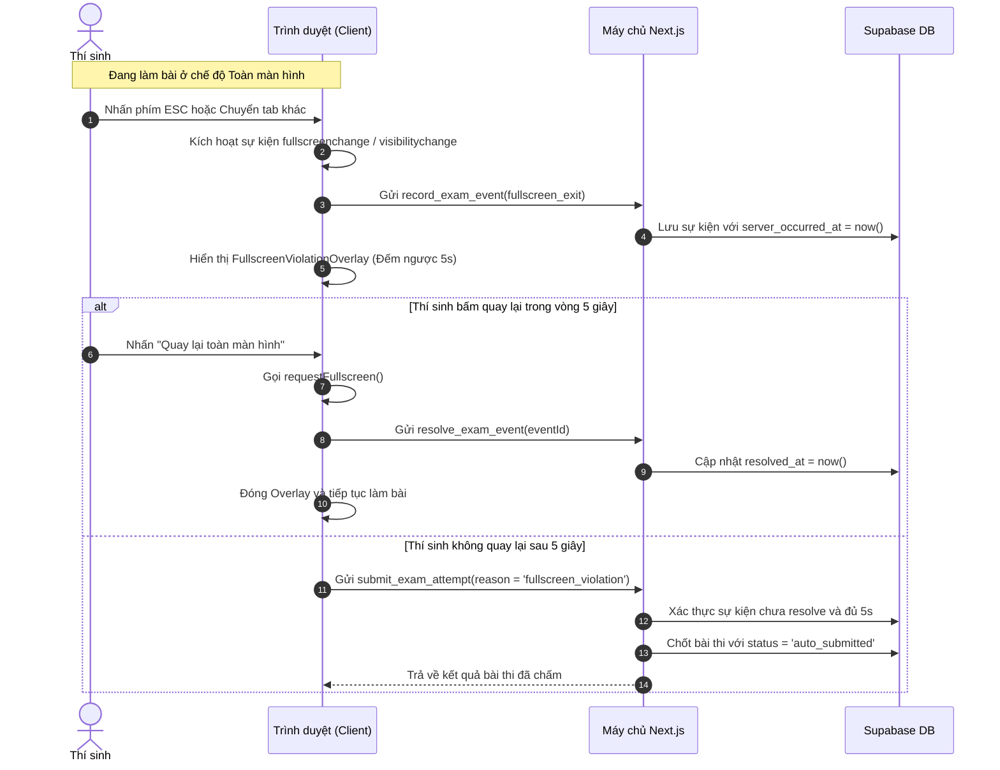

# Chính Sách Chống Gian Lận & Giám Sát Toàn Màn Hình (Fullscreen Policy)

- **Ngày cập nhật**: 2026-08-22
- **Phiên bản**: 1.0
- **Trạng thái**: Đã nghiệm thu & Hoạt động

---

## Mục Lục

1. [Mục đích & Giới hạn kỹ thuật](#1-mục-đích--giới-hạn-kỹ-thuật)
2. [Hỗ trợ thiết bị & Trình duyệt](#2-hỗ-trợ-thiết-bị--trình-duyệt)
3. [Quy trình kích hoạt chế độ toàn màn hình](#3-quy-trình-kích-hoạt-chế-độ-toàn-màn-hình)
4. [Xử lý sự kiện vi phạm & Màn hình khóa (Overlay)](#4-xử-lý-sự-kiện-vi-phạm--màn-hình-khóa-overlay)
5. [Xác thực vi phạm phía máy chủ](#5-xác-thực-vi-phạm-phía-máy-chủ)
6. [Sơ đồ tuần tự xử lý vi phạm (Sequence Diagram)](#6-sơ-đồ-tuần-tự-xử-lý-vi-phạm-sequence-diagram)
7. [Tiêu chuẩn nghiệm thu & Kịch bản kiểm thử](#7-tiêu-chuẩn-nghiệm-thu--kịch-bản-kiểm-thử)

---

## 1. Mục Đích & Giới Hạn Kỹ Thuật

Chế độ toàn màn hình (`Fullscreen Mode`) và giám sát trạng thái chuyển tab (`Visibility State`) nhằm tạo ra môi trường thi tập trung, giảm thiểu tối đa hành vi rời khỏi màn hình làm bài để tìm kiếm tài liệu trên cùng một thiết bị.

> [!NOTE]
> **Giới hạn kỹ thuật**: Trình duyệt web hiện đại không cho phép website can thiệp vào cấp độ hệ điều hành hoặc kiểm soát các thiết bị ngoại vi khác (như điện thoại, máy tính thứ hai). Do đó, chính sách này đóng vai trò như một lớp phòng vệ tiêu chuẩn kết hợp với nhật ký sự kiện (`exam_events`) để phục vụ công tác hậu kiểm.

---

## 2. Hỗ Trợ Thiết Bị & Trình Duyệt

- **Hỗ trợ tối ưu**: Google Chrome, Microsoft Edge, Mozilla Firefox, Apple Safari phiên bản hiện hành trên máy tính để bàn (Desktop / Laptop) và máy tính bảng hỗ trợ HTML5 Fullscreen API.
- **Cấu hình trên từng đề thi**: Trường `fullscreen_required` (`boolean`, mặc định `true`).
  - Khi `fullscreen_required = true`: Thí sinh bắt buộc phải kích hoạt toàn màn hình mới có thể bắt đầu làm bài.
  - Khi `fullscreen_required = false`: Thí sinh có thể làm bài ở chế độ cửa sổ thông thường mà không kích hoạt cơ chế tự động nộp bài khi chuyển tab.
- **Xử lý thiết bị không tương thích**: Nếu thí sinh dùng trình duyệt không hỗ trợ Fullscreen API trên đề thi bắt buộc, hệ thống hiển thị thông báo yêu cầu chuyển sang trình duyệt phù hợp trên máy tính và không tạo bài thi (đồng hồ chưa chạy).

---

## 3. Quy Trình Kích Hoạt Chế Độ Toàn Màn Hình

1. **Hiển thị màn hình chuẩn bị (Fullscreen Gate)**: Trước khi làm bài, thí sinh được xem thông tin tóm tắt về đề thi và quy chế thi toàn màn hình.
2. **Kích hoạt bằng thao tác người dùng (User Gesture)**:
   - Thí sinh nhấn nút **"Bắt đầu làm bài (Vào toàn màn hình)"**.
   - Trình duyệt thực thi `element.requestFullscreen()`.
   - Sau khi vào toàn màn hình thành công, hệ thống mới gửi yêu cầu `startExamAttemptAction` lên máy chủ để khởi tạo thời gian làm bài.
3. **Tuyệt đối không tự động kích hoạt**: Hệ thống không tự ý gọi fullscreen khi tải trang hoặc qua bộ đếm thời gian mà không có cú click chuột trực tiếp từ người dùng (tuân thủ chuẩn bảo mật trình duyệt).

---

## 4. Xử Lý Sự Kiện Vi Phạm & Màn Hình Khóa (Overlay)

Trong suốt quá trình làm bài (`status = 'in_progress'`) trên các đề thi bắt buộc toàn màn hình:

1. **Phát hiện vi phạm**:
   - Sự kiện `fullscreenchange`: Phát hiện khi `document.fullscreenElement` trở về `null` (thí sinh nhấn phím ESC, thu nhỏ cửa sổ hoặc thoát fullscreen).
   - Sự kiện `visibilitychange`: Phát hiện khi `document.visibilityState === 'hidden'` (thí sinh chuyển tab hoặc mở ứng dụng khác).
2. **Kích hoạt màn hình khóa (Fullscreen Violation Overlay)**:
   - Ngay lập tức phủ toàn màn hình, vô hiệu hóa toàn bộ chuột và bàn phím tương tác với bài thi.
   - Bắt đầu đồng hồ đếm ngược **5 giây ân hạn**.
   - Hiển thị thông báo: *"Bạn đã rời khỏi chế độ toàn màn hình. Hãy bấm 'Quay lại toàn màn hình' trong vòng 5 giây để tiếp tục bài thi."*
   - Gửi sự kiện `record_exam_event` lên máy chủ với loại `fullscreen_exit` hoặc `visibility_hidden`.
3. **Xử lý quay lại kịp thời (trong vòng 5 giây)**:
   - Thí sinh nhấn nút **"Quay lại toàn màn hình"**.
   - Trình duyệt tái kích hoạt fullscreen và gửi RPC `resolve_exam_event`.
   - Màn hình khóa biến mất, thí sinh tiếp tục làm bài bình thường.
4. **Xử lý vi phạm quá thời gian (hết 5 giây)**:
   - Nếu sau 5 giây thí sinh không quay lại, client gửi yêu cầu nộp bài tự động với `submit_reason = 'fullscreen_violation'`.
   - Hệ thống khóa bài thi, chấm điểm và chuyển sang trang kết quả.

---

## 5. Xác Thực Vi Phạm Phía Máy Chủ

Để chống gian lận can thiệp vào mã nguồn JavaScript phía client (như sửa bộ đếm thời gian client thành 60 giây):

- Máy chủ lưu mốc thời gian vi phạm `server_occurred_at = now()`.
- Khi nhận yêu cầu nộp bài với lý do `fullscreen_violation`, máy chủ kiểm tra xem có sự kiện vi phạm nào chưa được giải quyết (`resolved_at IS NULL`) và khoảng cách thời gian `now() - server_occurred_at >= 5 seconds` hay chưa.
- Nếu chưa đủ 5 giây, máy chủ từ chối yêu cầu nộp phạt và bảo vệ quyền lợi cho thí sinh.

---

## 6. Sơ Đồ Tuần Tự Xử Lý Vi Phạm (Sequence Diagram)

---

## 7. Tiêu Chuẩn Nghiệm Thu & Kịch Bản Kiểm Thử

| Mã Test | Điều kiện ban đầu | Thao tác thực hiện | Kết quả mong đợi |
| --- | --- | --- | --- |
| **TC-FULL-001** | Đề thi bắt buộc fullscreen | Nhấn "Bắt đầu làm bài" | Vào toàn màn hình thành công, sau đó mới tạo lượt thi |
| **TC-FULL-002** | Đang làm bài thi | Nhấn phím ESC thoát fullscreen | Xuất hiện màn hình khóa đếm ngược 5 giây |
| **TC-FULL-003** | Màn hình khóa đang đếm ngược | Nhấn "Quay lại toàn màn hình" trước 5s | Đóng màn hình khóa, sự kiện được ghi nhận giải quyết |
| **TC-FULL-004** | Màn hình khóa đang đếm ngược | Để quá 5 giây không quay lại | Tự động nộp bài với `submit_reason = fullscreen_violation` |
| **TC-FULL-005** | Đề thi không bắt buộc fullscreen | Chuyển tab hoặc thoát toàn màn hình | Không bị khóa màn hình và không bị tự động nộp bài |
| **TC-FULL-006** | Can thiệp timer client | Sửa timer client lên 60 giây | Máy chủ vẫn tự động thu bài theo mốc thời gian `server_occurred_at` |
