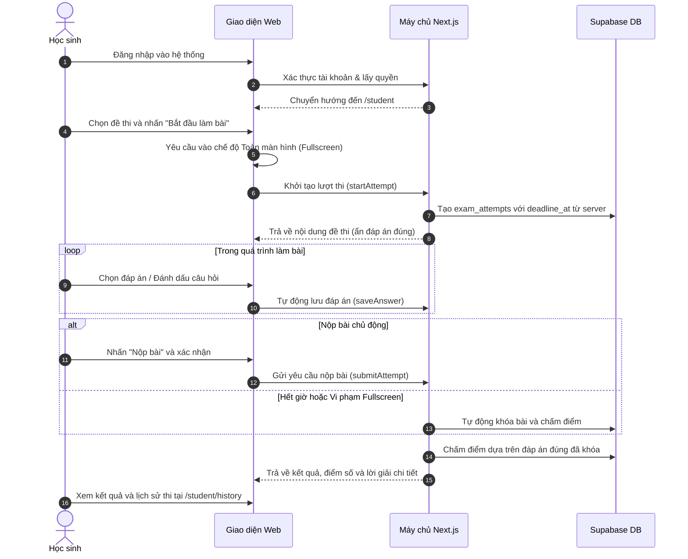

# Tài Liệu Yêu Cầu Sản Phẩm (Product Requirements Document)

- **Ngày cập nhật**: 2026-08-22
- **Phiên bản**: 1.0 (Hoàn thiện triển khai)
- **Trạng thái**: Đã nghiệm thu & Hoạt động

---

## Mục Lục

1. [Tổng quan sản phẩm](#1-tổng-quan-sản-phẩm)
2. [Vấn đề cần giải quyết](#2-vấn-đề-cần-giải-quyết)
3. [Mục tiêu sản phẩm](#3-mục-tiêu-sản-phẩm)
4. [Đối tượng người dùng](#4-đối-tượng-người-dùng)
5. [Phạm vi tính năng đã triển khai](#5-phạm-vi-tính-năng-đã-triển-khai)
6. [Hành trình người dùng (User Journeys)](#6-hành-trình-người-dùng-user-journeys)
7. [Yêu cầu chức năng chi tiết (Functional Requirements)](#7-yêu-cầu-chức-năng-chi-tiết-functional-requirements)
8. [Yêu cầu phi chức năng (Non-Functional Requirements)](#8-yêu-cầu-phi-chức-năng-non-functional-requirements)
9. [Bảo mật, hiệu năng và tính tương thích](#9-bảo-mật-hiệu-năng-và-tính-tương-thích)
10. [Rủi ro và giải pháp khắc phục](#10-rủi-ro-và-giải-pháp-khắc-phục)

---

## 1. Tổng Quan Sản Phẩm

**Exam Preparation App** là nền tảng luyện thi trực tuyến chuyên nghiệp phục vụ học sinh ôn luyện các kỳ thi quan trọng như Đánh giá năng lực (HSA, TSA), Tốt nghiệp THPT Quốc Gia và các kỳ thi chuẩn hóa. Hệ thống hỗ trợ hàng trăm người dùng đồng thời, đảm bảo tính bảo mật của đề thi, chống gian lận trong quá trình làm bài và cung cấp công cụ soạn thảo, quản trị toàn diện cho quản trị viên.

Nền tảng được xây dựng với nguyên tắc bảo mật chặt chẽ: không để lộ đáp án trước khi nộp bài, thời gian làm bài đồng bộ theo máy chủ (`server-enforced time`), và phân quyền theo cấp độ dữ liệu (Row Level Security - RLS).

---

## 2. Vấn Đề Cần Giải Quyết

- **Đối với học sinh**: Cần một môi trường luyện thi mô phỏng phòng thi thật với đồng hồ đếm ngược chính xác, lưu bài tự động không lo mất mạng, xem kết quả kèm đáp án và lời giải chi tiết để tiến bộ sau mỗi lần thi.
- **Đối với quản trị viên**: Cần công cụ trực quan để tạo môn học, danh mục, phân chia phần thi, soạn câu hỏi hỗ trợ ảnh (tải từ máy tính hoặc qua link), xuất bản/đóng đề và theo dõi kết quả, quản lý trạng thái tài khoản học sinh.
- **Về mặt kỹ thuật**: Cần ngăn chặn việc xem trước đáp án qua Network tab/DevTools, chống chỉnh sửa điểm số phía client, đảm bảo tính bất biến (idempotency) khi nộp bài và chịu tải tốt khi nhiều thí sinh nộp bài cùng lúc.

---

## 3. Mục Tiêu Sản Phẩm

| Mã | Mục tiêu | Thước đo thành công |
| --- | --- | --- |
| **GOAL-001** | Tìm kiếm & lọc đề thi mượt mà | Tìm kiếm từ khóa, môn học, danh mục trả kết quả dưới 2 giây |
| **GOAL-002** | Trải nghiệm phòng thi ổn định | Lưu đáp án tự động (autosave), phục hồi 100% tiến độ khi tải lại trang |
| **GOAL-003** | Giám sát & chống gian lận | Cảnh báo toàn màn hình (Fullscreen Guard), đếm ngược 5s khi thoát màn hình hoặc chuyển tab |
| **GOAL-004** | Bảo mật đề thi & chống lộ đáp án | Không trả trường `is_correct` xuống client trước khi bài thi được nộp |
| **GOAL-005** | Quản trị nội dung & học sinh | Tạo, biên tập, xuất bản, xóa mềm đề thi liên đới, khóa/mở khóa học sinh |
| **GOAL-006** | Hiệu năng chịu tải cao | Hỗ trợ 100 người dùng đồng thời (VU) với thời gian phản hồi p95 < 800ms, tỷ lệ lỗi 5xx < 1% |

---

## 4. Đối Tượng Người Dùng

| Nhóm | Mô tả | Quyền hạn & Nhu cầu chính |
| --- | --- | --- |
| **Guest (Khách)** | Người dùng chưa đăng nhập | Xem trang chủ, tra cứu thư viện đề công khai, làm thử các đề cho phép thi thử |
| **Student (Học sinh)** | Thí sinh đã đăng ký và kích hoạt | Làm bài thi, lưu đáp án, nộp bài, xem điểm số, lịch sử thi và kho tài liệu ôn tập |
| **Admin (Quản trị viên)** | Người quản lý hệ thống | Quản lý môn học, danh mục, soạn đề, tải ảnh câu hỏi, xuất bản/xóa đề, quản lý học sinh và tài liệu |

---

## 5. Phạm Vi Tính Năng Đã Triển Khai

1. **Xác thực & Phân quyền (Authentication & RBAC)**:
   - Đăng ký, đăng nhập bằng email/mật khẩu qua Supabase Auth.
   - Phân quyền theo vai trò `student` và `admin`, kiểm soát trạng thái `active` và `locked`.
   - Route guard cấp máy chủ và trang thông báo tài khoản bị khóa `/account-locked`.
2. **Khám phá đề thi (Catalog & Search)**:
   - Thư viện đề thi có thanh lọc đa tiêu chí (môn học, danh mục, từ khóa), phân trang phía server.
   - View bảo mật `public_exam_catalog` ẩn toàn bộ thông tin câu hỏi và đáp án trước khi thi.
3. **Phòng thi & Chống gian lận (Exam Engine & Integrity)**:
   - Kiểm tra hỗ trợ Fullscreen API trước khi tạo lượt thi.
   - Đồng hồ đếm ngược máy chủ, tự động lưu đáp án theo cơ chế upsert idempotent.
   - Cảnh báo thoát toàn màn hình / ẩn tab với thời gian ân hạn 5 giây; tự động nộp bài nếu vi phạm quá hạn.
   - Nộp bài tự động khi hết giờ thi (`submit_reason = time_expired`).
4. **Chấm điểm & Lịch sử học tập (Scoring & History)**:
   - Chấm điểm trắc nghiệm tức thì phía máy chủ ngay sau khi nộp bài.
   - Hiển thị bảng tổng kết số câu đúng/sai/bỏ qua, xem lời giải chi tiết theo cấu hình của đề.
   - Trang lịch sử thi cá nhân `/student/history` lưu trữ chi tiết từng lượt thi.
5. **Soạn thảo & Quản trị đề thi (Exam Builder & Admin)**:
   - Tạo đề thi với phân chia phần thi (sections), thứ tự câu hỏi tăng dần.
   - Chức năng thêm hình ảnh minh họa cho câu hỏi (chọn tải từ máy tính hoặc nhập liên kết URL).
   - Điều hướng vị trí câu hỏi/phần thi lên/xuống.
   - Quản lý vòng đời đề thi: `draft` -> `published` -> `closed` -> `archived`.
   - **Xóa đề thi an toàn**: Cho phép xóa đề thi (kể cả đã xuất bản) kèm xóa mềm toàn bộ phần thi, câu hỏi, đáp án và tự động đóng các lượt thi đang làm dở.
6. **Quản lý học sinh & Lượt thi (Student & Attempts Admin)**:
   - Xem danh sách học sinh, thao tác khóa/mở khóa tài khoản (tự động nộp bài thi đang làm dở khi khóa).
   - Tra cứu và xem chi tiết toàn bộ lượt thi của tất cả học sinh, hỗ trợ reset lượt thi.
7. **Quản trị tài liệu ôn tập (Document Management)**:
   - Tải lên tài liệu PDF hoặc nhập liên kết tài liệu số bên ngoài.
   - Phân quyền xem tài liệu theo trạng thái công khai hoặc dành riêng cho học sinh.
8. **Bảng điều khiển quản trị (Admin Dashboard)**:
   - Thống kê chỉ số: tổng đề thi, tổng học sinh, tổng lượt thi, điểm trung bình.
   - Biểu đồ phân bổ điểm số và danh sách hoạt động thi gần nhất.

---

## 6. Hành Trình Người Dùng (User Journeys)

### Hành trình Học sinh (Student Journey)

---

## 7. Yêu Cầu Chức Năng Chi Tiết (Functional Requirements)

| Mã yêu cầu | Tên chức năng | Mô tả chi tiết | Mức độ | Tiêu chí nghiệm thu |
| --- | --- | --- | --- | --- |
| **FR-AUTH-001** | Đăng ký & Đăng nhập | Cho phép học sinh tạo tài khoản và đăng nhập qua email | Bắt buộc | Tài khoản được tạo với role `student` và status `active` |
| **FR-AUTH-002** | Khóa tài khoản | Admin có quyền khóa tài khoản học sinh | Bắt buộc | Học sinh bị khóa không thể bắt đầu bài mới; bài đang làm bị tự động nộp |
| **FR-EXAM-001** | Tạo & Soạn đề thi | Admin tạo đề thi, chia phần thi và tạo câu hỏi | Bắt buộc | Vị trí câu hỏi không bị trùng lặp; tự động tính tổng điểm khi xuất bản |
| **FR-EXAM-002** | Tải ảnh câu hỏi | Tải ảnh trực tiếp từ máy tính hoặc liên kết URL | Bắt buộc | Ảnh được lưu trữ chuẩn xác và hiển thị mượt mà trong đề thi |
| **FR-EXAM-003** | Xóa đề thi toàn diện | Cho phép xóa đề thi ở mọi trạng thái | Bắt buộc | Xóa mềm đề thi, sections, questions, options và đóng các lượt thi đang làm |
| **FR-EXAM-004** | Vòng đời đề thi | Chuyển trạng thái Draft -> Published -> Closed -> Archived | Bắt buộc | Nội dung câu hỏi được bảo vệ chống sửa đổi sau khi đã có lượt thi |
| **FR-EXAM-005** | Nhân bản đề thi | Cho phép nhân bản đề thi đã có lượt thi để chỉnh sửa | Bắt buộc | Tạo bản sao độc lập ở trạng thái Draft với ID câu hỏi mới |
| **FR-FULL-001** | Chống gian lận Fullscreen | Giám sát toàn màn hình và trạng thái ẩn tab | Bắt buộc | Đếm ngược 5 giây khi rời màn hình; tự động nộp bài nếu vi phạm quá hạn |
| **FR-ATTEMPT-001** | Đồng hồ đếm ngược | Thời gian thi tính toán hoàn toàn theo server | Bắt buộc | Thay đổi giờ máy tính client không ảnh hưởng đến thời hạn nộp bài |
| **FR-ATTEMPT-002** | Lưu đáp án Idempotent | Lưu đáp án tức thời theo cặp `(attempt_id, question_id)` | Bắt buộc | Không tạo bản ghi trùng lặp; khôi phục đầy đủ đáp án khi tải lại trang |
| **FR-SCORE-001** | Chấm điểm tự động | Tự động so khớp với đáp án đúng và tính điểm số | Bắt buộc | Điểm số và thời gian chốt bất biến sau khi bài thi hoàn thành |
| **FR-DOC-001** | Quản lý tài liệu | Admin đăng tài liệu ôn tập và học sinh xem/tải | Bổ sung | Phân quyền truy cập chính xác theo trạng thái công khai |

---

## 8. Yêu Cầu Phi Chức Năng (Non-Functional Requirements)

| Mã yêu cầu | Tiêu chuẩn | Chỉ số đo lường |
| --- | --- | --- |
| **NFR-PERF-001** | Hiệu năng chịu tải | 100 VU đồng thời: p95 `startAttempt` <= 800ms, p95 `saveAnswer` <= 500ms, p95 `submitAttempt` <= 1200ms |
| **NFR-SEC-001** | An toàn dữ liệu (RLS) | 100% bảng nhạy cảm được bảo vệ bởi Supabase RLS; học sinh chỉ đọc/ghi dữ liệu của chính mình |
| **NFR-SEC-002** | Chống lộ đáp án | Tuyệt đối không gửi trường `is_correct` và `explanation` xuống client trước khi nộp bài |
| **NFR-REL-001** | Tính bất biến (Idempotency) | Thao tác nộp bài song song hoặc gửi lại nhiều lần không làm sai lệch điểm số |
| **NFR-A11Y-001** | Tiếp cận & Thẩm mỹ | Giao diện hỗ trợ Dark/Light theme, Glassmorphism cao cấp, tương thích bàn phím |
| **NFR-COMPAT-001** | Khả năng tương thích | Hoạt động hoàn hảo trên Chrome, Edge, Firefox, Safari (Desktop & Tablet) |

---

## 9. Bảo Mật, Hiệu Năng Và Tính Tương Thích

- **Bảo mật**: Sử dụng Supabase RLS policies kiểm tra vai trò `public.is_admin()`, xác thực quyền sở hữu `auth.uid() = student_id`, kiểm soát token khách `guest_session_hash`.
- **Hiệu năng**: Các trường khóa ngoại và điều kiện lọc đều được đánh chỉ mục (B-Tree & Partial Indexes); không ghi log đồng hồ đếm ngược từng giây vào database; áp dụng kỹ thuật debounce khi lưu đáp án.
- **Tương thích**: Hỗ trợ đầy đủ màn hình Responsive từ mobile (375px) đến desktop màn hình rộng (1920px+).

---

## 10. Rủi Ro Và Giải Pháp Khắc Phục

| Rủi ro | Mức độ | Giải pháp kỹ thuật đã triển khai |
| --- | --- | --- |
| Thí sinh ngắt mạng khi đang thi | Trung bình | Client lưu tạm đáp án và tự động gửi lại khi có mạng; thời gian thi vẫn chốt theo server deadline |
| Trình duyệt không hỗ trợ Fullscreen | Thấp | Kiểm tra trước khi bắt đầu bài; hiển thị thông báo hướng dẫn thí sinh sử dụng trình duyệt phù hợp |
| Nộp bài trùng lặp khi mạng chập chờn | Thấp | Áp dụng Transaction + Row-level lock (`SELECT ... FOR UPDATE`) và cơ chế Idempotency |
| Xóa nhầm đề thi đang có người làm | Trung bình | Hộp thoại xác nhận hành động nguy hiểm căn trái rõ ràng; tự động kết thúc an toàn các bài đang làm |
